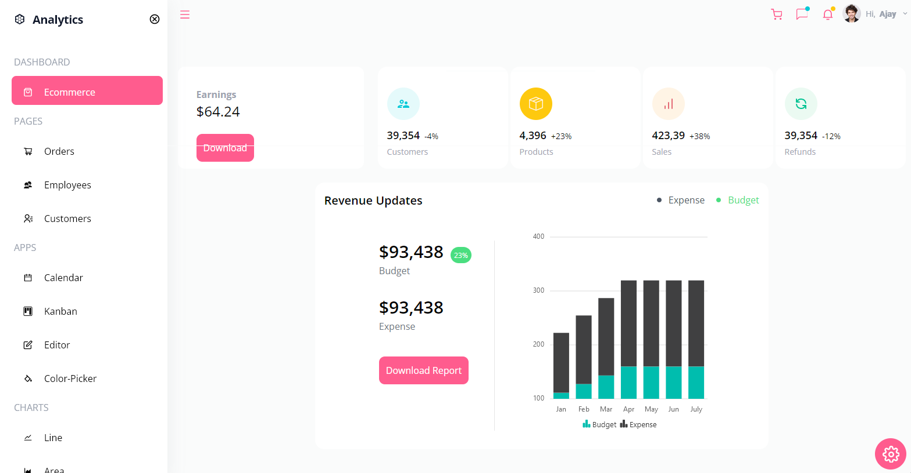
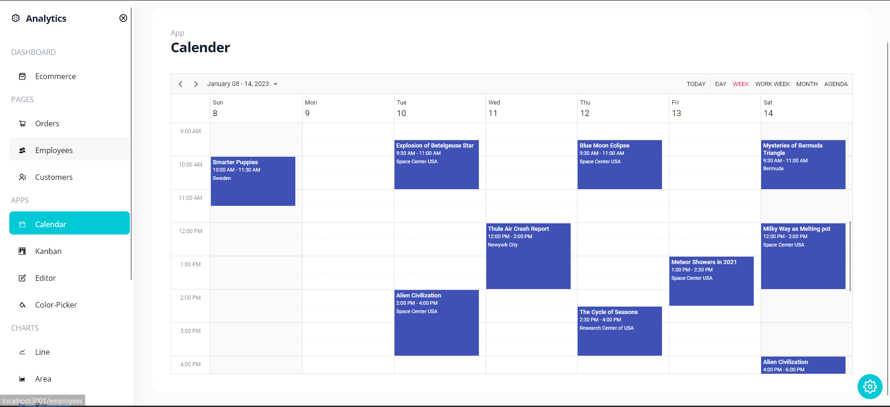
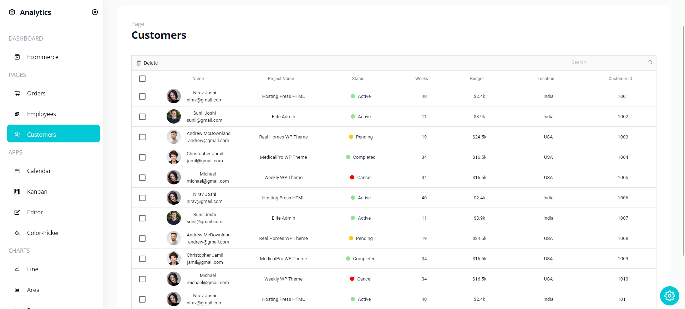
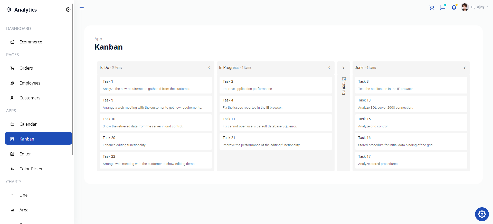

# Getting Started with Create React App

This comprehensive React-based dashboard app offers a powerful suite of functionalities and tools to manage various aspects of business and productivity. It provides an intuitive interface with a focus on data visualization, task management, editing capabilities, and color selection.

## Key Features:

1. Dashboard:
   Grid-based layout presenting sales data, customer details, employee data, and product insights.
   Features include sorting, searching, and deletion for enhanced data management.
2. Calendar:
   Task scheduling and management on a daily, weekly, or monthly basis.
   Efficient task tracking and organization for improved productivity.
3. Kanban Board:
   Task progress tracking and editing functionalities.
   Visual representation of tasks in different stages of completion.
4. Text Editor:
   Feature-rich text editor providing a range of editing capabilities.
   Customizable options for text manipulation and formatting.
5. Color Picker:
   Intuitive color palette allowing users to select and obtain color codes.
   Simplified color selection for various design and development purposes.
6. Charts:
   Multiple chart types including Line Chart, Bar Chart, and Histogram.
   Visual representation of data for better analysis and decision-making.
   Usage:
   The app is designed to streamline business processes, aid in task management, facilitate text editing, and simplify color selection. Users can leverage the dashboard's functionalities for data-driven insights and efficient task handling.

Technologies:
Built using React, syncfusion the app utilizes various libraries and components to ensure a responsive and interactive user experience. It employs robust data visualization techniques and UI/UX design principles.

## Available Scripts

In the project directory, you can run:

### `npm start`

Runs the app in the development mode.\
Open [http://localhost:3000](http://localhost:3000) to view it in your browser.

The page will reload when you make changes.\
You may also see any lint errors in the console.

### `npm test`

Launches the test runner in the interactive watch mode.\
See the section about [running tests](https://facebook.github.io/create-react-app/docs/running-tests) for more information.

### `npm run build`

Builds the app for production to the `build` folder.\
It correctly bundles React in production mode and optimizes the build for the best performance.

The build is minified and the filenames include the hashes.\
Your app is ready to be deployed!

See the section about [deployment](https://facebook.github.io/create-react-app/docs/deployment) for more information.

### `npm run eject`

**Note: this is a one-way operation. Once you `eject`, you can't go back!**

If you aren't satisfied with the build tool and configuration choices, you can `eject` at any time. This command will remove the single build dependency from your project.

Instead, it will copy all the configuration files and the transitive dependencies (webpack, Babel, ESLint, etc) right into your project so you have full control over them. All of the commands except `eject` will still work, but they will point to the copied scripts so you can tweak them. At this point you're on your own.

You don't have to ever use `eject`. The curated feature set is suitable for small and middle deployments, and you shouldn't feel obligated to use this feature. However we understand that this tool wouldn't be useful if you couldn't customize it when you are ready for it.